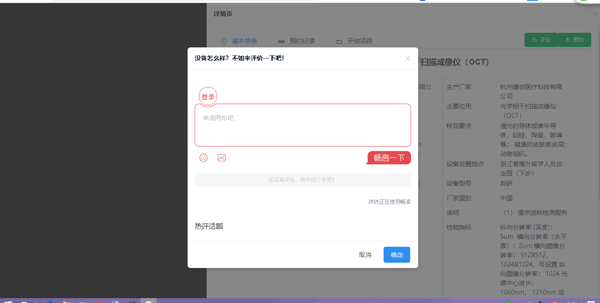

## 前言

>&emsp;&emsp;上天总会眷顾默默努力寻求答案的人，当然这里并不是自吹自擂，而是，在我解决完这个技术问题之前，在百度并没有找到任何合适的解决方案。Emmm，废话不多说，开始干。

## 业务描述

### 基本业务

#### Vue嵌入搜狐畅言

>&emsp;&emsp;也许有人问我，好好的jQuery+Html5不用，为什么来搞Vue。我想说，技术潮流在变，现在不也是vue、react、angular的风潮吗，为何不紧跟时代的步伐呢？
>&emsp;&emsp;一名合格的技术人员需要有最基本的追求素养，那就是不断进步，不断提升自我，在我看来就是，能活多久，就学多久吧！

>需求描述：在最基础的Vue组件中嵌入搜狐畅言，当然在此之前需要说明的是，这里指的是Vue开发的单页SPA应用。

>解决思路：

>- 步骤一、在需要引入畅言的地方写入`<div id="SOHUCS" ></div>`，无论是何种接入场景，都需要这个‘敲门砖’。这里稍微提一下，畅言快站那里的：单页应用引入畅言的第二个步骤描述有误，它描述的是，先删除那个div，但是我亲手实践过得结果是，必须要有，不然会报错`找不到id为SOHUCS的div容器`！
>- 步骤二、在Vue的生命周期的钩子函数（特指`mounted`）中或者按需加载的虚拟DOM点击事件中去接入官网提供的JS代码。
```javascript
//这里示例的是在按需加载的DOM点击事件中
 selectTab(){
                    console.log('start');
                    this.modal = true;
                    eval('(function(){ \n' +
                        'const appid = \'xxxx\'; \n' +
                        'const conf = \'xxxxxx\'; \n' +
                        'const width = window.innerWidth || document.documentElement.clientWidth; \n' +
                        'if (width < 960) { \n' +
                        'window.document.write(\'<script id="changyan_mobile_js" charset="utf-8" type="text/javascript" src="https://changyan.sohu.com/upload/mobile/wap-js/changyan_mobile.js?client_id=\' + appid + \'&conf=\' + conf + \'"><\\/script>\'); } else { var loadJs=function(d,a){var c=document.getElementsByTagName("head")[0]||document.head||document.documentElement;var b=document.createElement("script");b.setAttribute("type","text/javascript");b.setAttribute("charset","UTF-8");b.setAttribute("src",d);if(typeof a==="function"){if(window.attachEvent){b.onreadystatechange=function(){var e=b.readyState;if(e==="loaded"||e==="complete"){b.onreadystatechange=null;a()}}}else{b.onload=a}}c.appendChild(b)};loadJs("https://changyan.sohu.com/upload/changyan.js",function(){window.changyan.api.config({appid:appid,conf:conf})}); } })();')

            }
```

>说明：我尝试了写入script标签，但是就是无法自动执行函数，所以，我索性利用`eval()`函数，在业界这个东西可谓是：“食之无味，弃之可惜”，原因就是它存在一定安全隐患，不过此处使用关系不大。

>特别说明：我在官网示例代码的基础上，将所有的`var`定义的变量，全部改为了拥有块级作用域的`const`常量定义模式，原因在于Vue-cli 3.0下的处理模式就是会默认屏蔽掉所有暴露在全局的变量，所以使用`var`声明是大忌。

>美美的贴上我的成果：
>

### 复杂业务

#### 单个组件多处调用搜狐畅言

>需求描述：比如统一组件内有多个子模块需要引入畅言，那就势必用到`v-for`进行扩展，这个时候问题就来了：我们的畅言容器`<div id="SOHUCS" ></div>`,这个东东的在整个页面中只能存在一个。

>问题解决：要说解决办法也不是没有，那就是重构畅言的源码，把畅言的承载容器用class标识，这样就解决了同一组件多处使用的问题，当然，这个不太现实，但也无失为一种解决思路。

## 小结

>&emsp;&emsp;Now！所有的问题就解决完成了，现在是凌晨2:16，麻麻说再不睡会猝死的，更何况我这种在宿舍熄灯情况下（学校在23:00整准时停电），坐在洗手间为大家总结博客，hia hia hia，说笑了，希望能帮助到大家。
>&emsp;&emsp;最后奉上一句话共勉：人生路漫漫，要敢拼而不是想着怎么赚钱怎么潇洒，要过得有意义不是吗？
